## Setting up S3
### refer https://www.nexttonone.lol/upload-s3
- allowing anyone/anything to be able to get sth from the s3 bucket
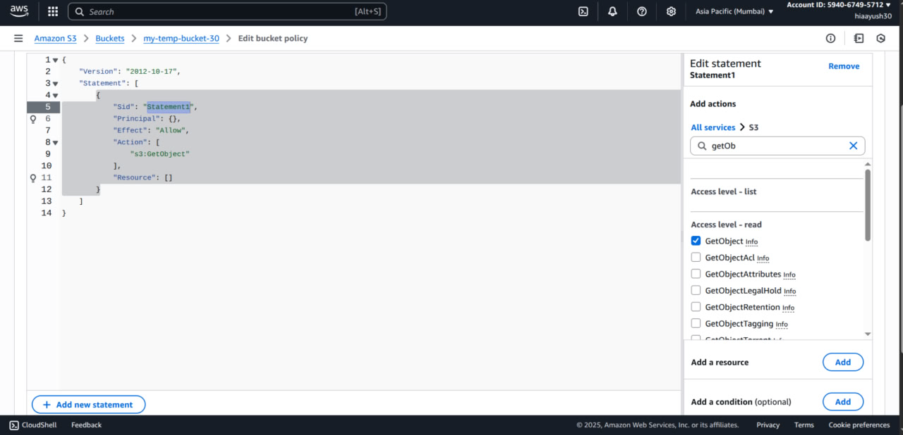
.png)
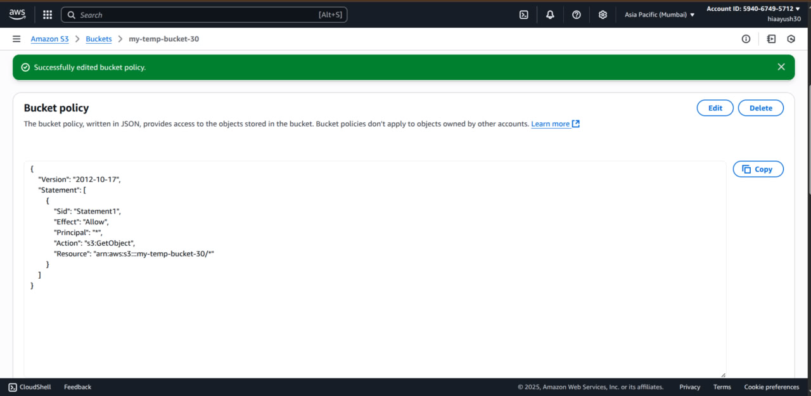
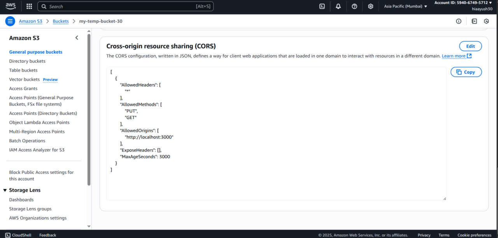

- now create credentials to give our app permission to access this bucket
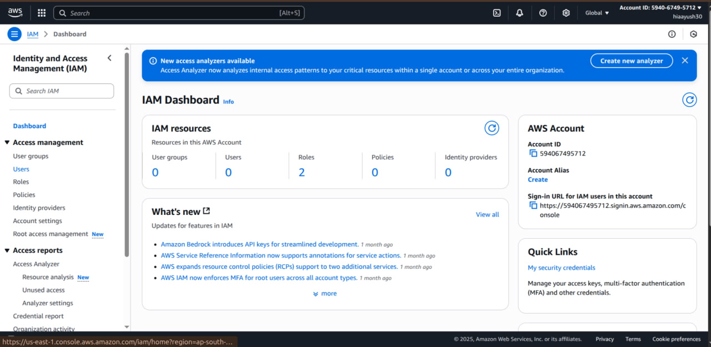
- users in IAM can be real life users (with username and password) or they can apps that have access key and secret key
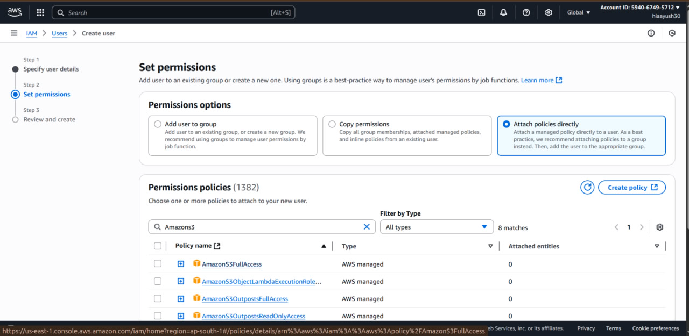
- you can give AmazonS3FullAccess but this would allow user or app to create and delete entire buckets or objects inside buckets so click on create policy

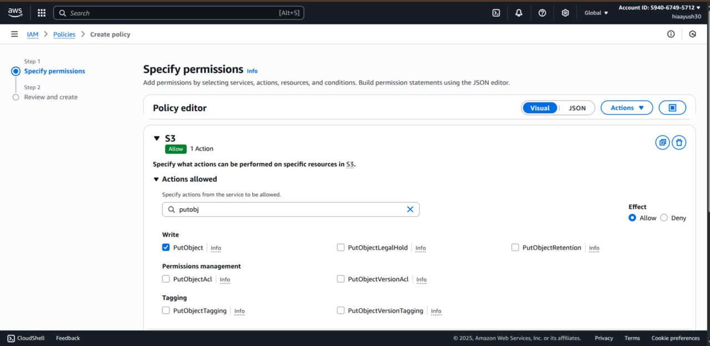
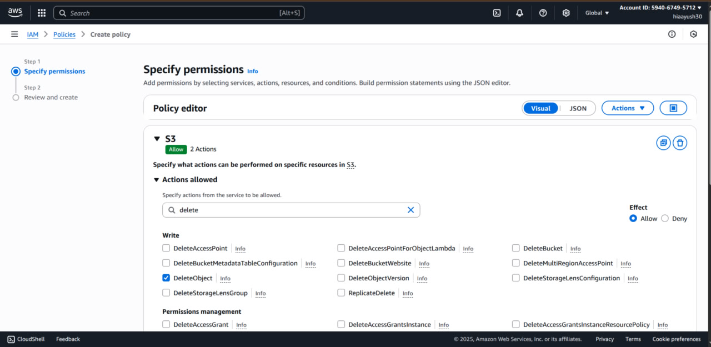
- allowing only putObject and deleteObject
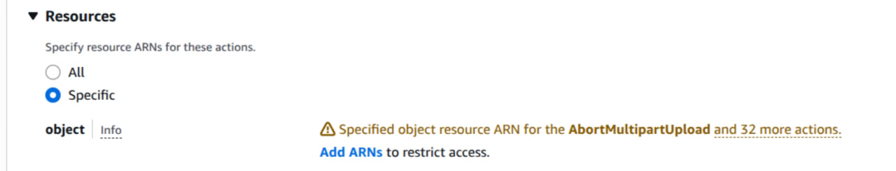
- click on add arn
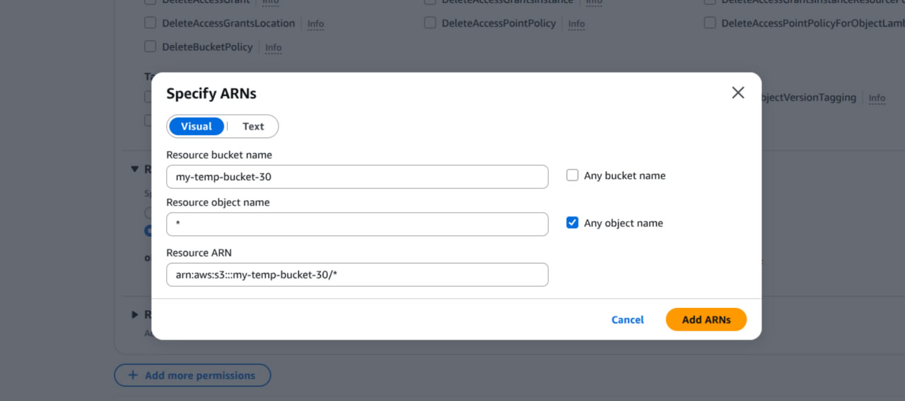
- allows any file in this specific bucket to be created or deleted
- click on add arn and then on next
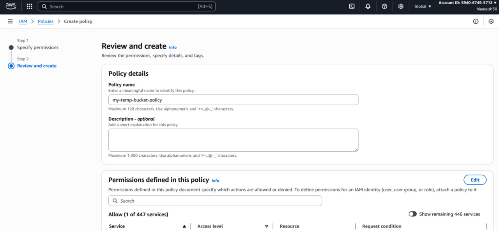
- click on create policy and then go back to  policies tab and refresh it
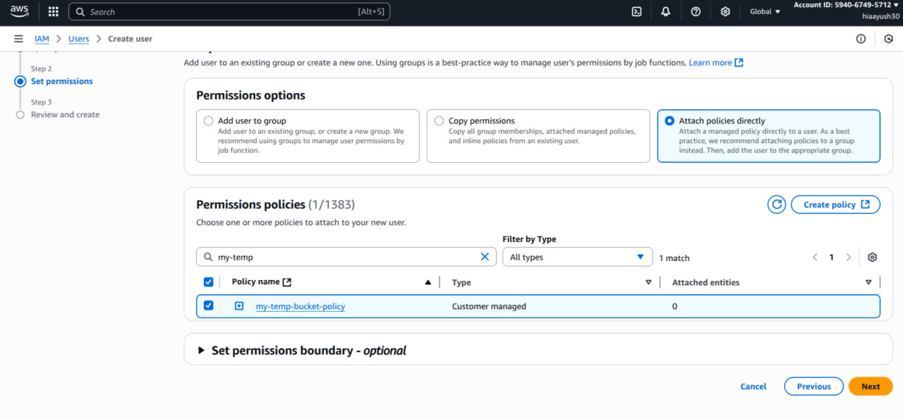
- click on next and then on create user
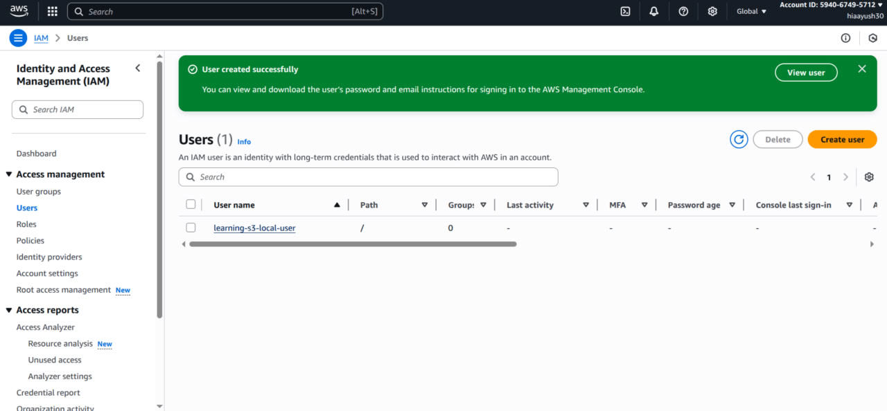
- you have a new user and now you want the access keys 🙂
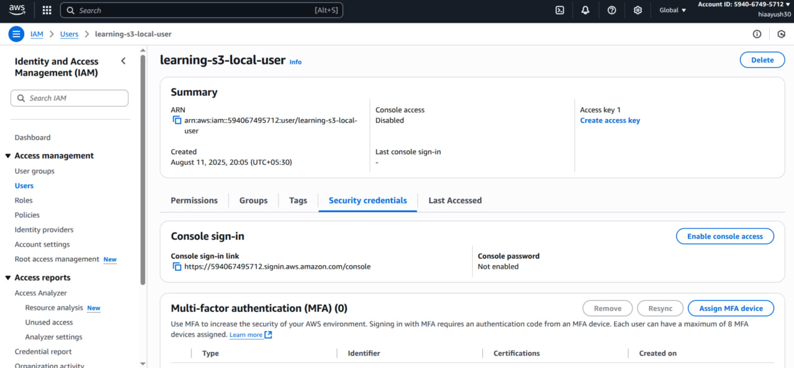
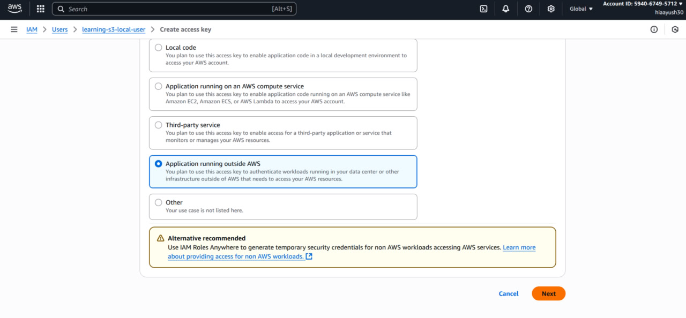
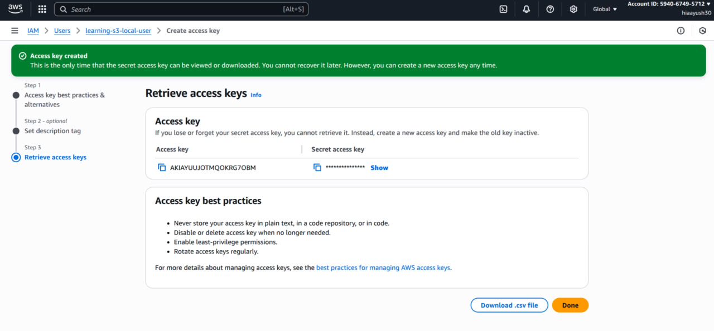
---
- we can't give the client the complete access to s3 else they will be able to upload delete anything in the bucket
- so instead we will communicate with our server which will generate a unique url which allows uploading of only that individual file and then the handleSubmit() can send this file to S3

```
npm i @aws-sdk/client-s3 @aws-sdk/s3-request-presigner
```