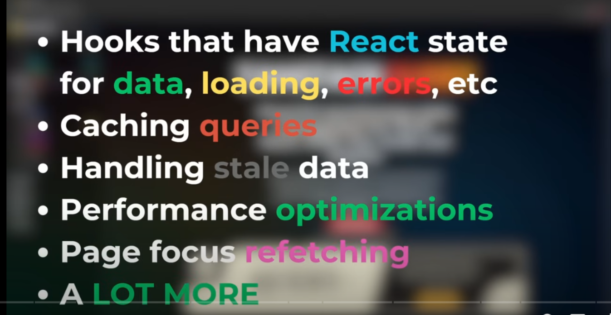

## React Query / Tanstack Query
- it's a querying and state mgmt library(asynchronous),it provides hooks that =>


---

### **`useQuery`**

* Used when you want to **fetch one resource** (or one logical set of data) at a time.
* You give it:

  * A **`queryKey`** (unique ID for caching).
  * A **`queryFn`** (function to fetch the data).
* Returns the state (`data`, `isLoading`, `error`, etc.) for that single query.

```js
const { data, isLoading, error } = useQuery({
  queryKey: ['user', userId],
  queryFn: () => fetchUser(userId),
});
```

---

### **`useQueries`**

* Used when you need to **run multiple independent queries at once**.
* Takes an **array** of query configs — each works like a `useQuery`.
* Returns an **array of results** in the same order as the configs.
* Useful when you want multiple data sets to load in parallel.

```js
const results = useQueries({
  queries: [
    {
      queryKey: ['user', userId],
      queryFn: () => fetchUser(userId),
    },
    {
      queryKey: ['posts', userId],
      queryFn: () => fetchPosts(userId),
    }
  ],
});

const user = results[0].data;
const posts = results[1].data;
```

---

**Main difference in usage:**

* **If you only need one query → `useQuery`**.
* **If you need multiple unrelated queries → `useQueries`**.
  They run in parallel and each has its own state.

---

If you want, I can give you a **side-by-side table** comparing `useQuery` and `useQueries` so you can remember it instantly.
